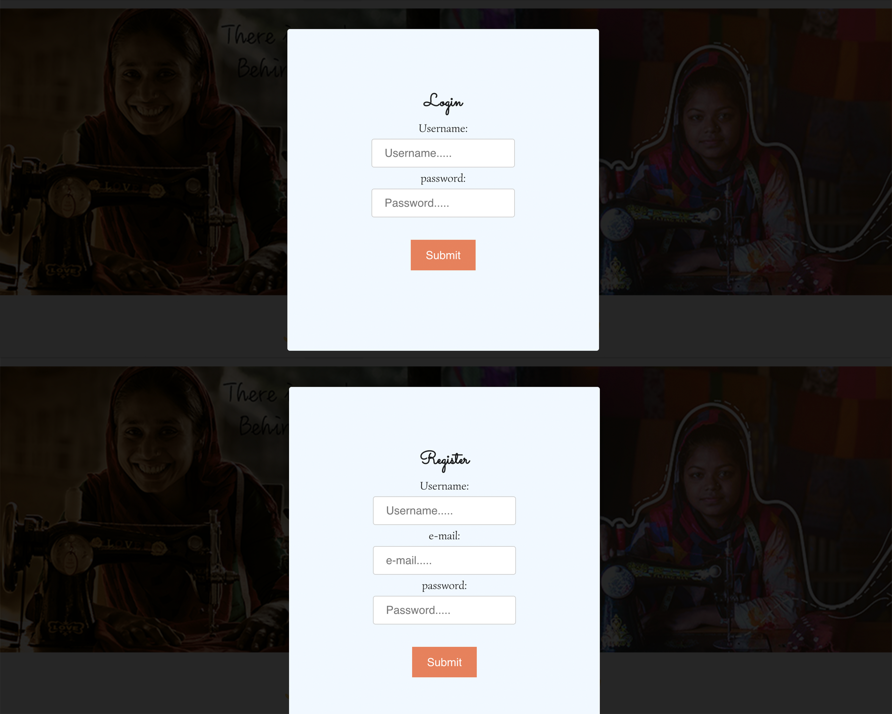
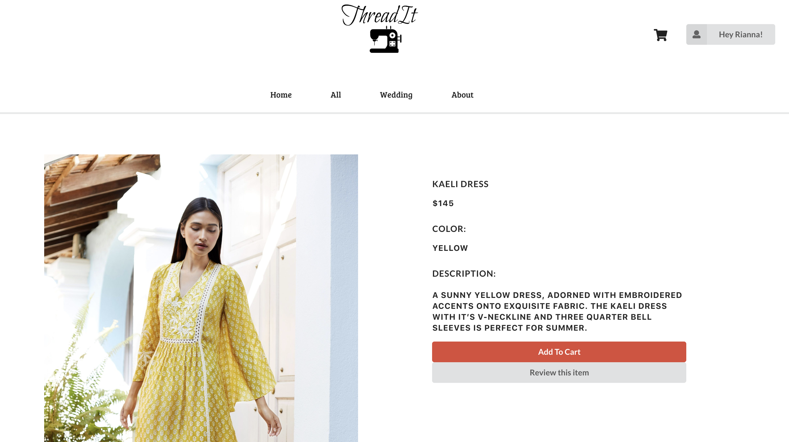
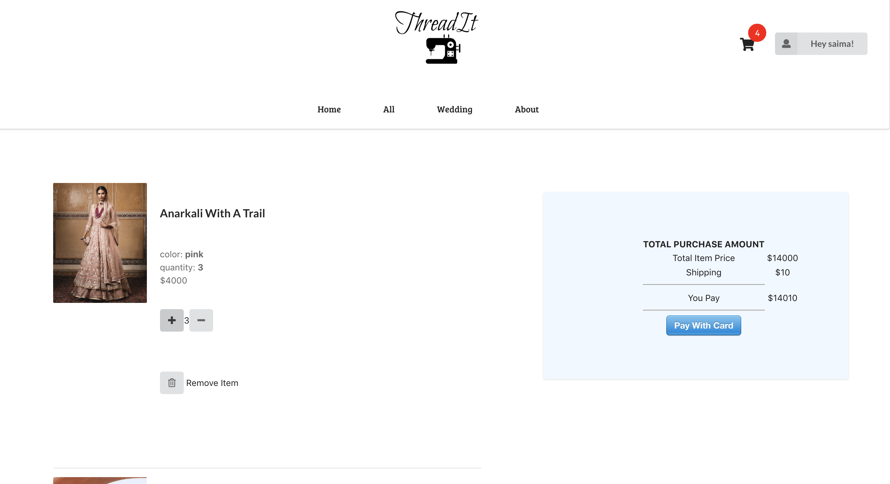
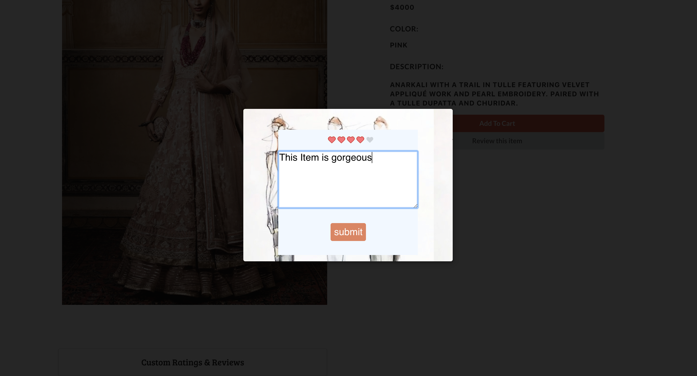

   #                                                  ThreadIt
**ThreadIt** is a shopping website, created by Saima Rahman. This website was inspired by an Indian Designer, [Anita Dongre](https://us.anitadongre.com/), her idea on **sustainable** clothing, **fair-wage** and as well as **women empowerment**! Some of the images have been taken from her website. 

## :arrow_forward: Checkout my demo [here](https://youtu.be/qzQDJL2lFHw).
  
   ## Tech Stack 
**Frontend** 
- React.js
- React Router - Declarative Routing
- Redux [4.0.5]
- Semantic UI React
- Custom CSS3 styling
- Stripe API

**[Backend ~ API](https://github.com/saimaar/threadIt-API)**
- Ruby [2.6.1]
- Rails [~> 5.2.3] - MVC web framework used as an API
- Bcrypt [~> 3.1.7] - Gem for encryption and securing user passwords
- Dotenv - Rails gem for securing API Keys
- Active Model Serializers - Serializing API routes to JSON
- JWT - securing tokens
- PostgreSQL [>= 0.18, < 2.0] - Database
- Stripe - Stripe Ruby gives access to the Stripe API from applications written in the Ruby language

## Code Guide 
If you would like to take a closer look at the code behind the ThreadIt App, the best folders to look in are:
- [index.js](src/index.js)
- [React Components](src/Components)
- [Redux Folder](src/Redux)
- [App.js](src/App.js)
- [Models Img](src/image-folder/Models.png) 

## Features
- Authentication
   - Session is authenticated in the backend. All queries return data that corresponds to the proper user.
   - Users can sign up and log in from any page in the app.
- Create 
   - User can create an order for any item or items
- Reviews on Items
   - Users can post reviews for different items.
- Filter/Sort 
   - Users can filter items by color & category
   - Users can sort items by Highest/Lowest Price
- Add Items
   - Users can add items to their cart 
- Update/Remove Cart Items
   - Users can update Cart Item quantity
   - Users can delete Cart Items
- Delete
   - Users can delete their account
## Screenshots 
### Login/Register 

---
### All Items Page 

---
### Show Page 

---
### Cart Items

---
### Review/Ratings 

## Installing
**Backend Installation:**

- Clone backend repo to your local machine git clone <backend-repo-url>
- run bundle install to install required dependencies
- Ensure you have PostgreSQL running
- run rails db:create to create a database locally.
- run rails db:migrate to create tables into the database.
- run rails db:seed to create seed data.
- run rails s -p 4000 to run the server.
   
**Frontend Installation:**

- Clone this repo to your local machine git clone <this-repo-url>
- Ensure your Backend API is running at http://localhost:4000/
- run npm install to install all dependencies
- run npm start to start server
- When prompted, ensure Frontend is running at http://localhost:3000
